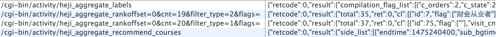
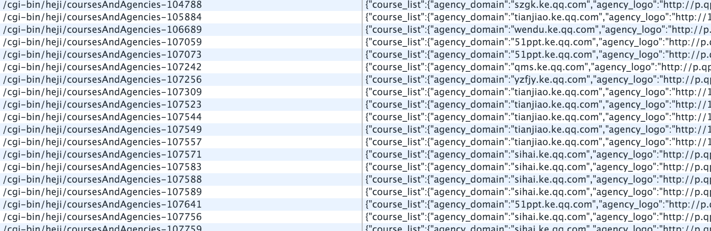

# 客户端存储体系

## 问题
参见(使用localStorage必须了解的点)[http://imweb.io/topic/5590a443fbb23aae3d5e450a]。
常见的“请求链接加参数”作为 localStorge key 值会造成大量的数据冗余，如下：
```
list?[1,2,3,4]
list?[3,4]
list?[1,4]
```
这在存储容量本来就很小的客户端是不可接受的。

## 思路

```
list@1
list@2
list@3
list@4
```
采用如上形式，在不降低性能的同时消除数据的荣誉。

## 真实案例

